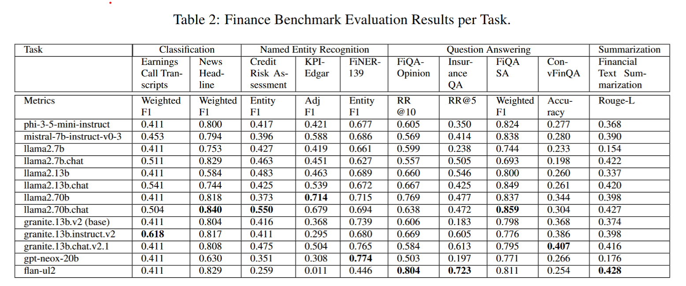
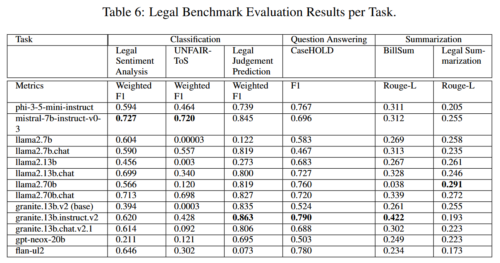
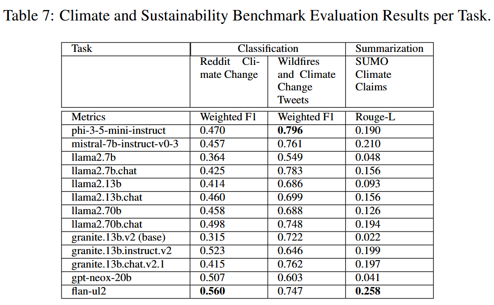
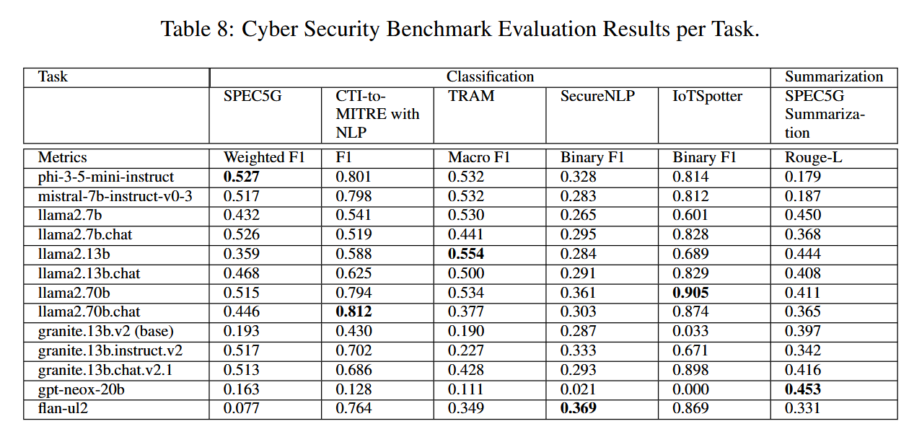

<!--intro-start-->
# Enterprise Benchmarks for Large Language Model Evaluation
<!-- This is a fork from the original HELM for a study of enterprise benchmarking of LLMs using domain-specific datasets.
The original README continues after this section. -->

## Introduction
This is a set of benchmarks and metrics for a study of enterprise benchmarking of LLMs using domain-specific datasets
from finance, legal, climate, and cyber security domains.

In many enterprise applications of LLMs, a model needs to process domain-specific text data.
In such cases, the performance of a model can be different from what is expected
from non-domain-specific benchmarks, such as benchmarks for language capabilities and common-sense knowledges.
Therefore, it is important to use a domain-specific dataset whose distribution is close to that of the actual application domain.

<!-- Here, public datasets from the above four domains were curated and corresponding scenarios were implemented. -->
The following scenarios are added.

- Finance
    - conv_fin_qa_calc
    - financial_phrasebank
    - gold_commodity_news (news_headline)
    - kpi_edgar
- Legal
    - casehold
    - echr_judgment_classification
    - legal_contract_summarization
    - legal_opinion_sentiment_classification
- Climate
    - sumosum
- Cyber security
    - cti_to_mitre

<!-- The following metrics are added or modified.
- kpi_edgar_metrics
- classification_metrics  (weighted_f1)
- basic_metrics  (float_equiv, a bug fix for f1_score) -->

## Getting started
Please follow the standard installation procedure. No additional steps are required for these benchmarks.

Here is an example of `run_specs.conf`
```json
entries: [
  {description: "gold_commodity_news:model=openai/gpt2,category=price_or_not", priority: 1},
  {description: "sumosum:model=openai/gpt2", priority: 1},
  {description: "legal_contract_summarization:model=openai/gpt2", priority: 1},
  {description: "casehold:model=openai/gpt2", priority: 1},
 ]
```
Then, the benchmark scenarios can be executed by the following command.
```sh
helm-run --conf-paths {path_to}/run_specs.conf -m 100 --suite a_benchmark_suite_v1
helm-summarize --suite a_benchmark_suite_v1
```

## Usage of the scenarios
Please refer to the docstring of the source code of each scenario, or the page shown by `helm-server` for the details (i.e., `src/helm/benchmark/static/schema_enterprise.yaml`). 

### Finance

#### conv_fin_qa_calc (ConvFinQACalc)
- Description: A mathematical calculation benchmark based on ConvFinQA: Exploring the Chain of Numerical Reasoning in Conversational Finance Question Answering [(Chen ey al., 2022)](https://arxiv.org/pdf/2210.03849.pdf).
- Scenario name: `conv_fin_qa_calc`
- Parameters:
- Metrics:
    - `float_equiv` (from `helm.benchmark.metrics.conv_fin_qa_calc_metrics.ConvFinQACalcMetric`)
- Source code: `src/helm/benchmark/scenarios/conv_fin_qa_calc_scenario.py`

#### financial_phrasebank (Financial Phrasebank)
- Description: A sentiment classification benchmark based on the dataset from Good Debt or Bad Debt - Detecting Semantic Orientations in Economic Texts [(Malo et al., 2013)](https://arxiv.org/abs/1307.5336).
- Scenario name: `financial_phrasebank`
- Parameters:
    - `agreement`: `int = 50`. Optional. Valid values are defined in `FinancialPhrasebankScenario.AGREEMENT_VALUES = [50, 66, 75, 100]`. This argument is used to specify the ratio of annotators who agreed on the ground truth label.
- Metrics:
    - `classification_weighted_f1`
- Source code: `src/helm/benchmark/scenarios/financial_phrasebank_scenario.py`

#### gold_commodity_news (Gold Commodity News)
- Description: A classification benchmark based on a dataset of human-annotated gold commodity news headlines ([Sinha & Khandait, 2019](https://arxiv.org/abs/2009.04202)).
- Scenario name: `gold_commodity_news`
- Parameters:
    - `category`: `str`  . This is a mandatory option. The task is to classify whether an input (a news headline) discusses about the category specified. One of the following values can be specified.
        - `price_or_not`: "the gold price",
        - `direction_up`: "the gold price heading up",
        - `direction_constant`: "the price remaining constant or stable",
        - `direction_down`: "the gold price heading down",
        - `past_price`: "any past information about gold prices",
        - `future_price`: "any future information about gold prices",
        - `past_news`: "any past information other than the gold prices",
        - `future_news`: "any future information other than the gold prices",
        - `assert_comparison`: "a comparison purely in the context of the gold commodity with another asset",
- Metrics:
    - `classification_weighted_f1`
- Source code: `src/helm/benchmark/scenarios/gold_commodity_news_scenario.py`

#### kpi_edgar (KPI EDGAR)
- Description: A named entity recognition beenchmark based on the paper KPI-EDGAR - A Novel Dataset and Accompanying Metric for Relation Extraction from Financial Documents [(Deußer et al., 2022)](https://arxiv.org/pdf/2210.09163.pdf).
- Scenario name: `kpi_edgar`
- Parameters:
- Metrics:
    - `word_macro_f1_score`  (from `helm.benchmark.metrics.kpi_edgar_metrics.KPIEdgarMetric`)
    - `adjusted_macro_f1_score`  (from `helm.benchmark.metrics.kpi_edgar_metrics.KPIEdgarMetric`)
- Source code: `src/helm/benchmark/scenarios/kpi_edgar_scenario.py`


### Legal

#### casehold (CASEHold)
- Description: CaseHOLD (Case Holdings On Legal Decisions) is a multiple choice question answering scenario where the task is to identify the relevant holding of a cited case [(Zheng et al, 2021)](https://arxiv.org/pdf/2104.08671.pdf).
- Scenario name: `casehold`
- Parameters:
- Metrics:
    - `f1` (instance-wide F1 in `basic_metrics.py`)
- Source code: `src/helm/benchmark/scenarios/casehold_scenario.py`

#### echr_judgment_classification (ECHR Judgement Classification)
- Description: The "Binary Violation" Classification task from the paper Neural Legal Judgment Prediction in English [(Chalkidis et al., 2019)](https://arxiv.org/pdf/1906.02059.pdf). The task is to analyze the description of a legal case from the European Court of Human Rights (ECHR), and classify it as positive if any human rights article or protocol has been violated and negative otherwise.
- Scenario name: `echr_judgment_classification`
- Parameters:
- Metrics:
    - `classification_weighted_f1`
- Source code: `src/helm/benchmark/scenarios/echr_judgment_classification_scenario.py`

#### legal_contract_summarization (Legal Contract Summarization)
- Description: Plain English Summarization of Contracts [(Manor et al., 2019)](https://aclanthology.org/W19-2201.pdf).
- Scenario name: `legal_contract_summarization`
- Parameters:
- Metrics:
    - `rouge_1`
    - `rouge_2`
    - `rouge_l`
- Source code: `src/helm/benchmark/scenarios/legal_contract_summarization_scenario.py`

#### legal_opinion_sentiment_classification (Legal Opinion Sentiment Classification)
- Description: A legal opinion sentiment classification task based on the paper Effective Approach to Develop a Sentiment Annotator For Legal Domain in a Low Resource Setting [(Ratnayaka et al., 2020)](https://arxiv.org/pdf/2011.00318.pdf).
- Scenario name: `legal_opinion_sentiment_classification`
- Parameters:
- Metrics:
    - `classification_weighted_f1`
- Source code: `src/helm/benchmark/scenarios/legal_opinion_sentiment_classification_scenario.py`

### Climate

#### sumosum (SUMO Web Claims Summarization)
- Description: A summarization benchmark based on the climate subset of the SUMO dataset ([Mishra et al., 2020](https://aclanthology.org/2020.wnut-1.12/)).
- Scenario name: `sumosum`
- Parameters:
- Metrics:
    - `rouge_1` 
    - `rouge_2` 
    - `rouge_l`
- Source code: `src/helm/benchmark/scenarios/sumosum_scenario.py`

### Cyber security

#### cti_to_mitre (CTI to MITRE)
- Description: A classification benchmark based on Automatic Mapping of Unstructured Cyber Threat Intelligence - An Experimental Study [(Orbinato et al., 2022)](https://arxiv.org/pdf/2208.12144.pdf).
- Scenario name: `cti_to_mitre`
- Parameters:
    - `num_options`: `int = 10`  Optional. Number of choices in multiple-choice task.
    - `seed`: `int = 42`  Optional. Seed for random module. The seed is set to random if specified.
- Metrics:
    - `exact_match`
- Source code: `src/helm/benchmark/scenarios/cti_to_mitre_scenario.py`


## Paper
This study is published in the following paper. Please cite this paper if you use this code in your research and you publish it.
- B. Zhang, M. Takeuchi, R. Kawahara, S. Asthana, Md. M. Hossain, G. Ren, K. Soule and Y. Zhu, “Enterprise Benchmarks for Large Language Model Evaluation.” arXiv preprint arXiv:2410.12857 2024. https://arxiv.org/abs/2410.12857

<!-- ```
@misc{zhang2024enterprisebenchmarkslargelanguage,
      title={Enterprise Benchmarks for Large Language Model Evaluation}, 
      author={Bing Zhang and Mikio Takeuchi and Ryo Kawahara and Shubhi Asthana and Md. Maruf Hossain and Guang-Jie Ren and Kate Soule and Yada Zhu},
      year={2024},
      eprint={2410.12857},
      archivePrefix={arXiv},
      primaryClass={cs.CL},
      url={https://arxiv.org/abs/2410.12857}, 
}
``` -->
```
@article{zhang2024enterprise,
  title={Enterprise Benchmarks for Large Language Model Evaluation},
  author={Zhang, Bing and Takeuchi, Mikio and Kawahara, Ryo and Asthana, Shubhi and Hossain, Md Maruf and Ren, Guang-Jie and Soule, Kate and Zhu, Yada},
  journal={arXiv preprint arXiv:2410.12857},
  url={https://arxiv.org/abs/2410.12857}, 
  year={2024}
}
```









## Contributors

Original contributors are as follows:

- Yada Zhu, Kate Soule (MIT-IBM Watson AI Lab)
- Mikio Takeuchi, Ryo Kawahara, Futoshi Iwama, Alisa Arno (IBM Research - Tokyo)
- Bing Zhang, Shubhi Asthana (IBM Almaden Research Lab)
- Md Maruf Hossain, Naoto Satoh, Guang-Jie Ren (former IBM members)
